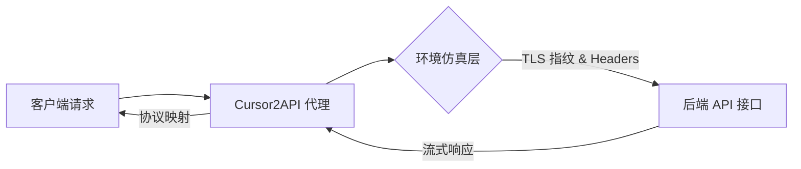

在 AI 领域，不同厂商的 API 接口标准（如 OpenAI 与 Anthropic）存在显著差异，这对开发者构建跨平台应用提出了挑战。

[Cursor2API](https://github.com/7836246/cursor2api) 是一个极具研究价值的开源项目。它不仅是一个适配器，更是一套关于**环境仿真**、**协议转换**与**流式数据处理**的技术实现方案。本文将深入解析该项目的核心架构与合规技术边界。

## 🛠️ 技术架构概览

Cursor2API 的核心职能是充当“协议中转与仿真器”，将特定的后端 API 接口转换为标准化的 OpenAI 或 Anthropic 兼容格式。

其核心交互链路如下：



---

## 🔬 核心技术原理解析

### 1. TLS 指纹模拟 (TLS Fingerprinting)

传统的 HTTP 请求库（如 `axios` 或标准 `curl`）在 TLS 握手阶段会暴露明显的指纹特征，容易被防爬系统拦截。Cursor2API 使用了 [surf](https://github.com/enetx/surf) 库来模拟现代浏览器的 TLS 特征。

- **伪装技术**：通过模拟 Chrome 的加密基元顺序与扩展字段，使请求在网络传输层表现得像一个真实浏览器。
- **动态 Header**：同步填充 `sec-ch-ua`、`sec-fetch-site` 等关键浏览器元数据。

### 2. 动态 x-is-human 令牌机制

为了验证请求的合法性，系统引入了动态校验机制。项目内嵌了一套轻量级的 JS 执行环境：

1. **环境模拟**：在 Node.js 环境中模拟 DOM API、WebGL 指纹及 Navigator 信息。
2. **脚本执行**：实时获取并运行后端验证脚本，生成具有时效性的 `x-is-human` Token。
3. **闭环验证**：该 Token 与请求指纹绑定，确保了请求的链路完整性。

### 3. 多协议双向映射

项目实现了高度复杂的协议解析层，支持在不同格式间无损转换：

- **输入解析**：解析 OpenAI 的 `messages` 数组或 Anthropic 的特定结构。
- **格式归一化**：将其映射为内部所需的 `submit-message` 负载格式。
- **输出流封装**：利用 Server-Sent Events (SSE) 技术，将非标准的流式反馈实时封装为标准的 OpenAI 流格式。

---

## 🛡️ 安全边界与合规使用场景

作为一个技术研究项目，Cursor2API 在设计上遵循了明确的安全边界：

### 安全实践
- **免 Key 架构**：项目通过技术手段实现协议兼容，不涉及任何外部 API Key 的传输与存储。
- **本地化部署**：支持 Docker 环境完全本地化运行，确保用户数据流向的可控性，避免隐私泄露。
- **无状态设计**：代理服务不持久化对话内容。

### 合格使用场景
1. **接口标准化研究**：研究如何构建通用的 API 转换框架，减少多模型集成成本。
2. **自动化集成测试**：在开发环境中模拟高性能 AI 响应，加速多端 UI 的适配开发。
3. **安全攻防研究**：作为对抗 TLS 检测与环境生成的学术样本，用于提升防爬系统的健壮性。

---

## ⚡️ 快速部署与集成

项目提供了一键式的容器化部署方案：

```bash
docker run -p 3010:3010 7836246/cursor2api
```

部署完成后，服务将监听在特定端口，支持通过 `/v1/chat/completions` (OpenAI) 或 `/v1/messages` (Anthropic) 接口进行访问。

---

## 📚 结语与免责说明

**声明**：[Cursor2API](https://github.com/7836246/cursor2api) 仅供技术交流与学术研究使用。使用者应严格遵守相关服务提供商的《服务条款》及当地法律法规。

通过对该项目的研究，我们可以窥见现代 Web 环境下，如何通过技术手段实现跨协议的无缝互操作性，以及环境仿真在 API 开发中的重要地位。
